# US-SUPERSTORE-PROJECT
## INTRODUCTION
A US superstore entering a new business year,having run business for four consecutive years (2014-2017). working based on the company's sales performance in the previous 
year 2017,are looking at any specific segments, quarter, months, category or states where they should pay more attention to..needing pointers to 
perform better and make informed decisions in the coming business year..Hence as a data analyst having sourced out data directly from the company 
would help analyse the data extensively using the folowing measures...
- Using the aforementioned data to create 6 possible questions and provide answers
- Clean,analyse and visualize
- Providing KPIs(key Performance Indicators)

Now let's get to work,manipulating,summarizing,cleaning ,visualizing and giving the company the best hands on the job while making them transite into 
the new business year fully kitted to hitting a new all high record on Sales..

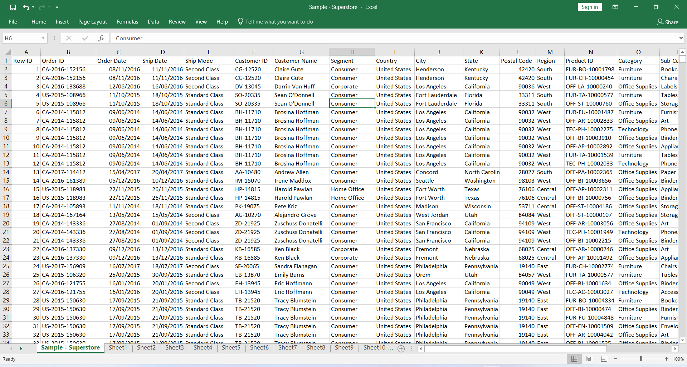
Looking at the above imaged dataset,9996 rows of data,we would concentrate our efforts on the following headers

- OREDER DATE
- SEGMENT
- STATE
- CATEGORY
- SUB-CATEGORY
- SALES

  Remember we already mapped out some measures to help in analysing this dataset extensively and one of such "Using the aforementioned data to create 6 possible questions and
  provide answers" ..so find below the following questions which will be asnwered basically using PIVOT TABLES AND DATA VISUALIZATION

  - Question 1:Total and Average Sales across all years
  - Question 2:Sales made across the months of 2017
  - Question 3:Sum of  sales for all quarters of the year 2017
  - Question 4:Sales made across segments and categories for the year 2017
  - Question 5:Sales across sub-categories for the year 2017
  - Question 6:10 Top and bottom states with the highest and lowest sales for the year 2017

  Now that questions have been created,next we have to clean,analyse and visulize after which KPIs would be provided

#### PIVOT TABLE TO THE RESCUE
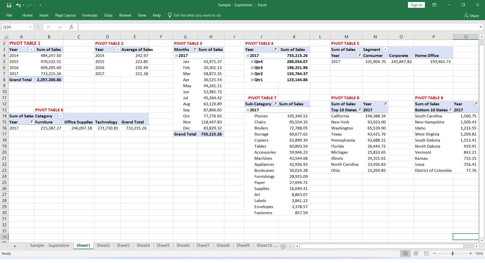
The above image is the use of PIVOT TABLES to answer all the above questions and not to forget that the year in view is 2017

 - PIVOT TABLE 1: Tabled the total sum of the sales across the years 2014-2017
 - PIVOT TABLE 2: Tabled the average sales across all years
 - PIVOT TABLE 3: Tabled the sales made across the months of 2017(the year in view)
 - PIVOT TABLE 4: Tabled the sum of sales for all four quarters of the year 2017
 - PIVOT TABLE 5: Tabled sales made across segemnts of the year 2017
 - PIVOT TABLE 6: Tabled sales made across categories for the year 2017
 - PIVOT TABLE 7: Tabled sales made across sub-categories for the year 2017
 - PIVOT TABLE 8: Tabled the top 10 states with the highest sales for the year 2017
 - PIVOT TABLE 9: Tabled the bottom 10 states with the lowest sales for the year 2017

#### NOW LET'S BRING DATA VISUALIZATION ON BOARD

##### CHART 1
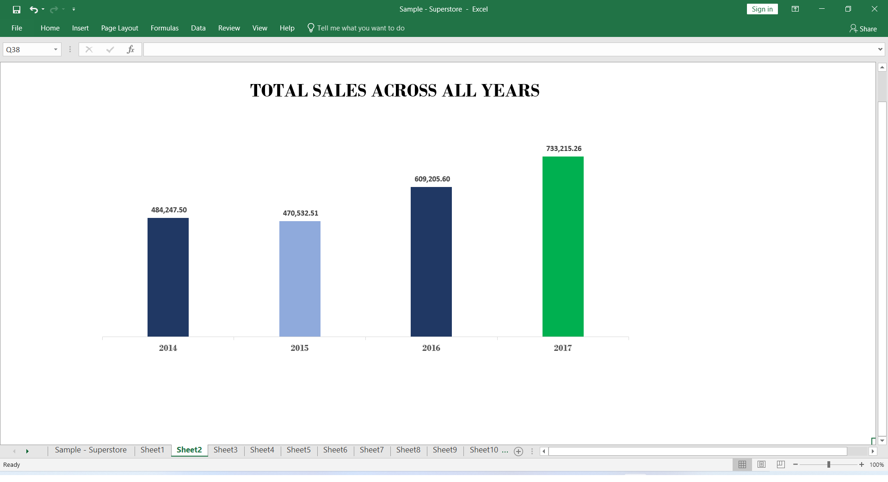
This is a 2-D column chart showing the sum of sales across all the years,this is important cos we need to see how the business has grown from it's inception 
to the very year in view and we can tell from the above chart that the year in view 2017(colored in green) has seen the highest sales recorded

##### CHART 2
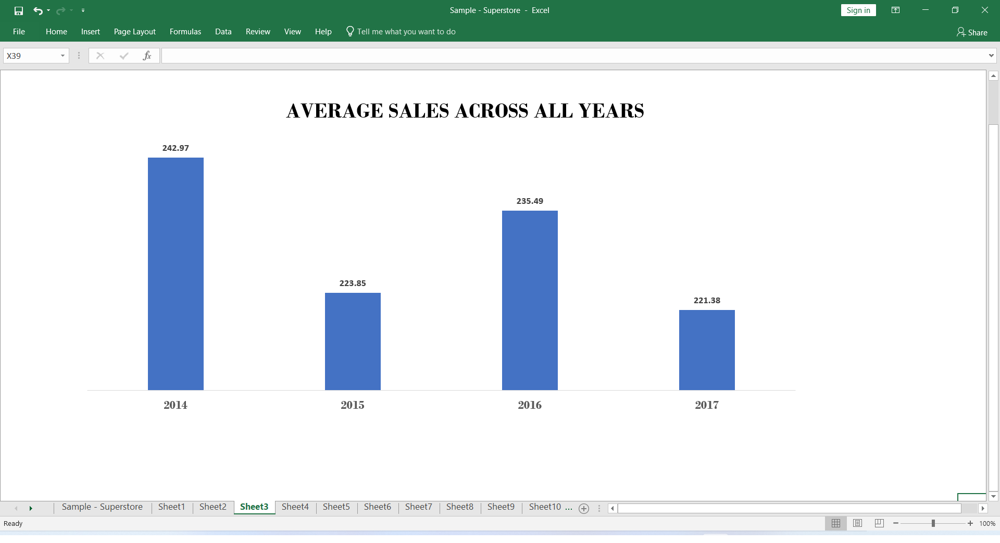
This is a 2-D column chart showing the sum of averages across all the years 2014-2017

##### CHART 3
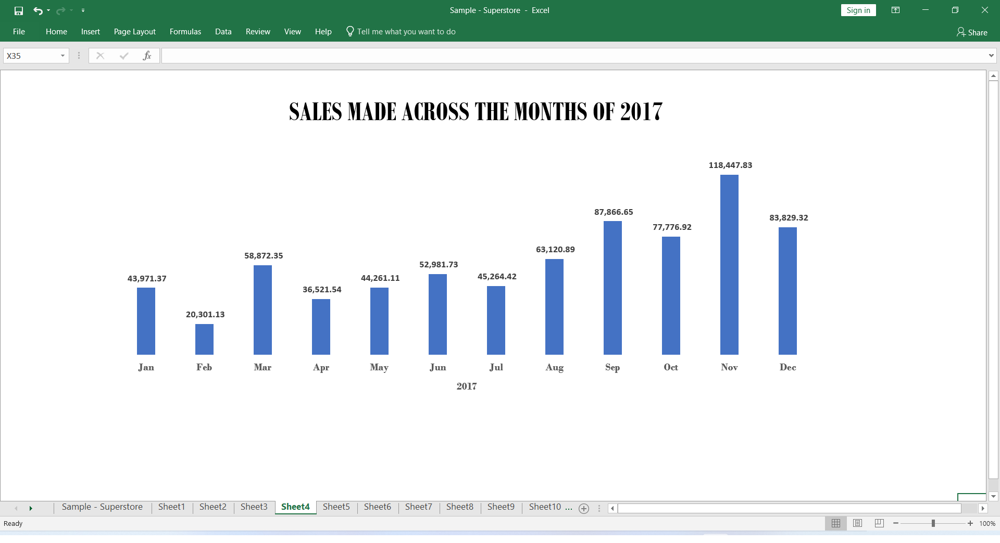
Now this is a visuaization concentrating on the year in view 2017,a 2-D chart showing the sales across the year and if we notice,towards the last five months
of the year saw significant rise in sales

##### CHART 4
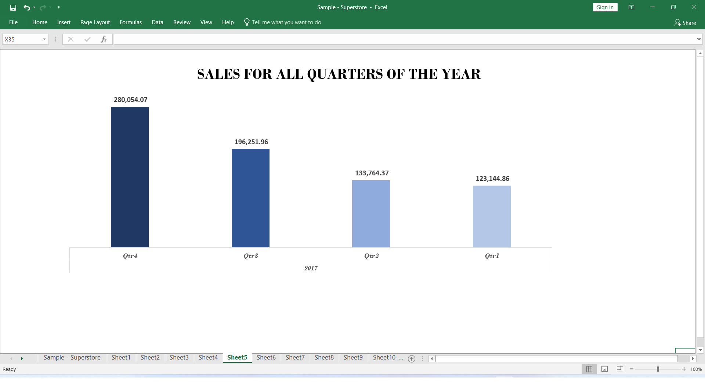
Chart 4 is another 2-D column chart showing the quarters in year 2017,and from our chart here we can deduce that the 4th quarter recorded the highest sales which was indicated 
with a darker shade of the color blue

##### CHART 5
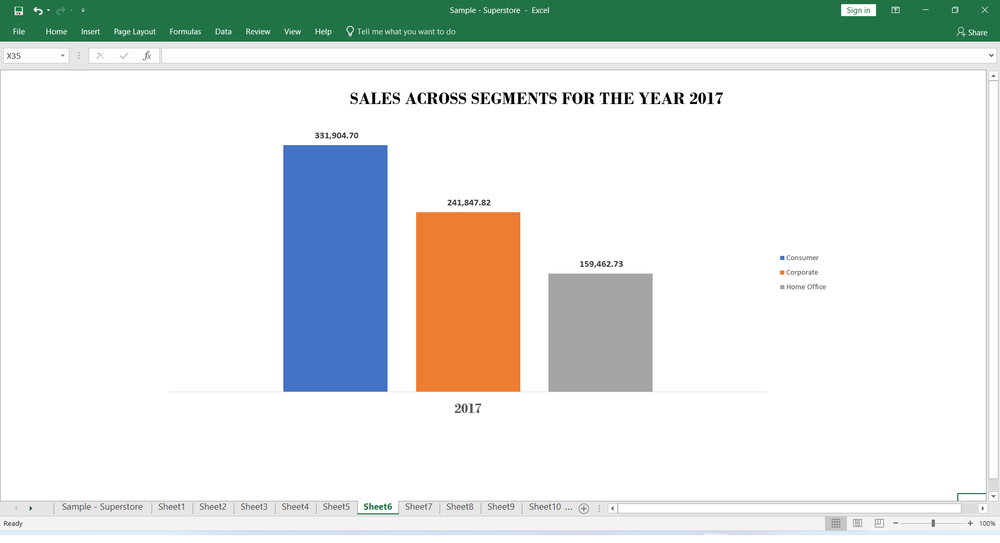
2-D columns seems to be the reign here,yet again showing sales across segments of the year 2017,finely colored and by the right hand side you can notice the segments
consumer,corporate and home office represented in words and little boxes of their respective colors known as legend(a funtion used on a chart) and we can see the segment
with the highest sales recorded which is the segment consumer,with the segment home office being the lowest

##### CHART 6
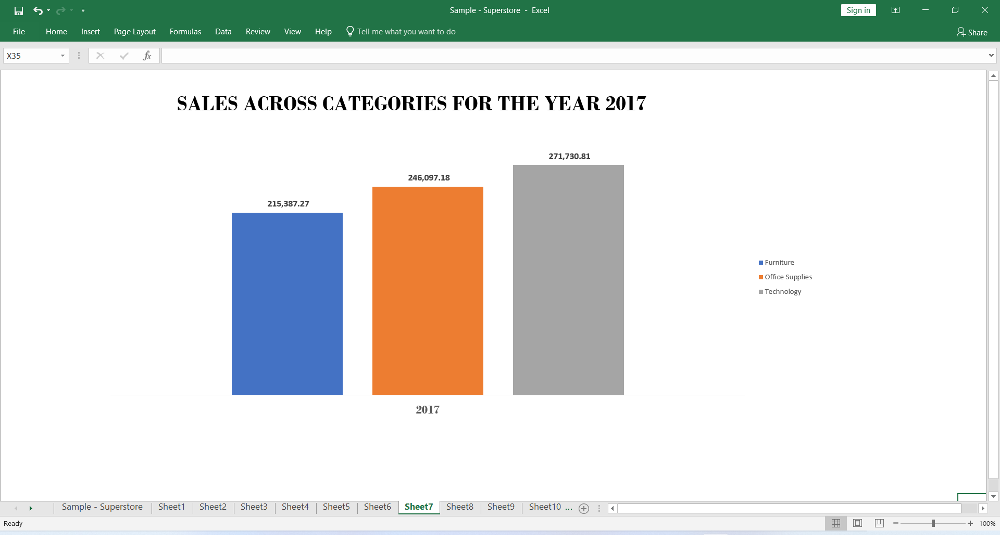
Displaying sales across the various categories as shown,furniture,office supplies and technology and the categoty Technology(colored in grey) had the
highest sales and the category furniture had the lowest sales recorded for the year 2017

##### CHART 7
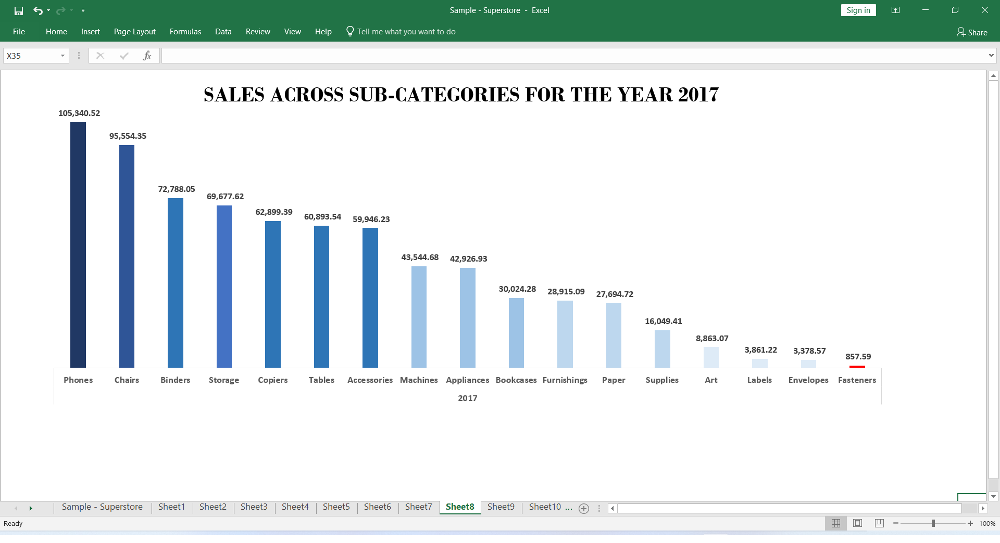
Shows the sales across sub-categories and from the chart we can see a downward movement showing from the highest sub-category recorded to the lowest..
do note as shown in chart 6 which shows technology to be the highest recorded category and phones being a sub-category of the category Technology recorded the
highest sales across all sub-categories.

##### CHART 8
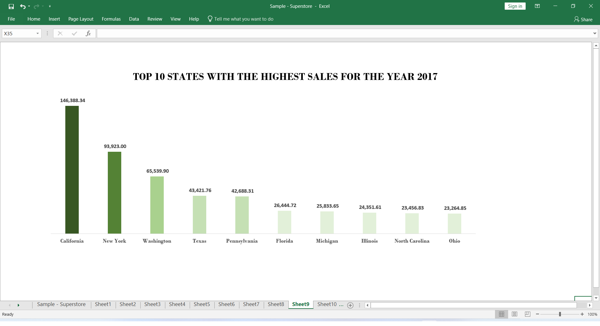
visualization with a 2-D column showing the top 10 states with the highest sales across the country for the year in view 2017 and as indicated on the chart,
labeled from the highest which is the state of California down to the state of Ohio,so this will futher make the company undertand states they have strengths in
and how to make the best with such states...

##### CHART 9
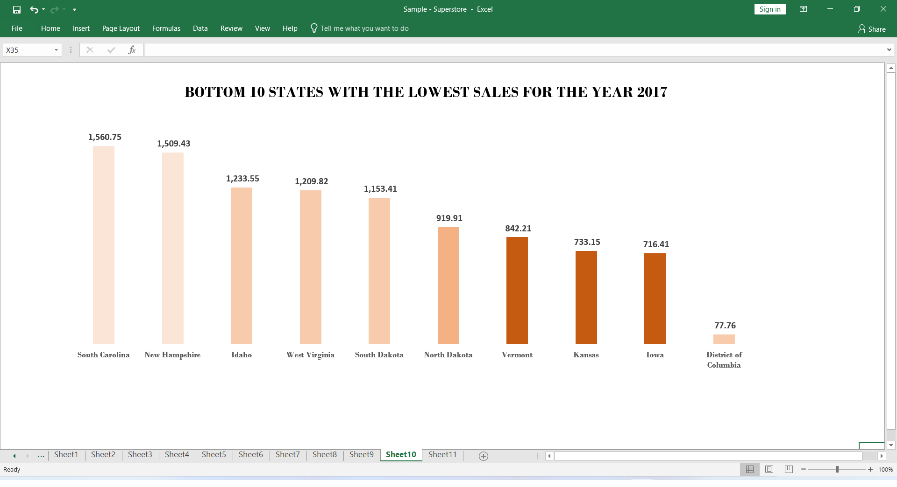
The bottom 10 states with the lowest state indicating from bad to worse,from South Carolina down to District of Columbia,This is to indicate to the company that it needs to
do to way better and pay more attention in the above shown states

##### CHART 10
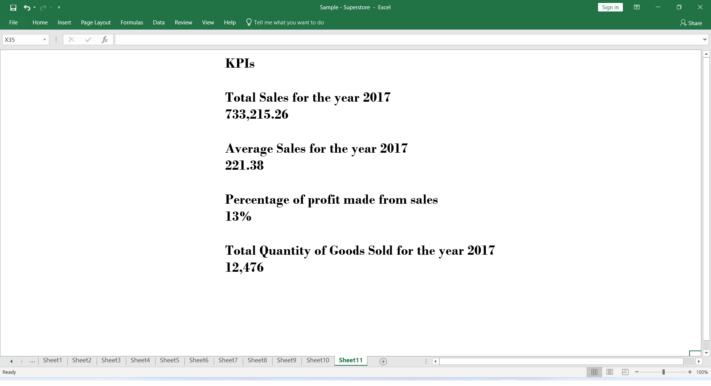
simply showing Key Performance Indicators 

## CONCLUSION
The store's database has been broken down into tables and charts hence have indicated the strenghts and weaknesses of the company's structure in reagrds to sales

